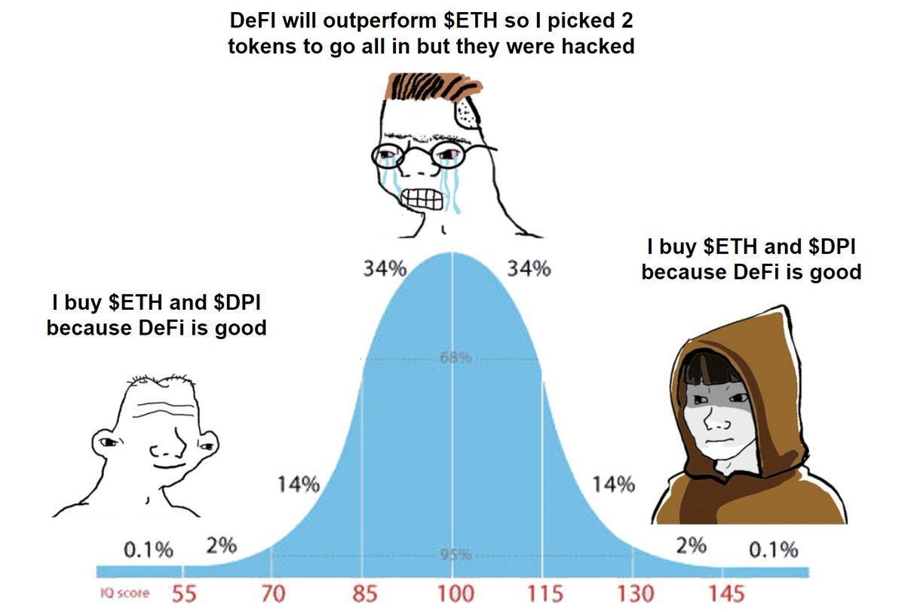
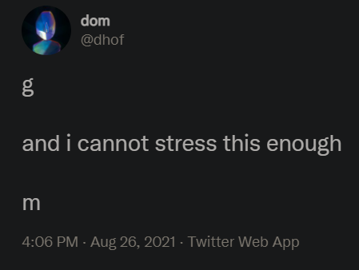

# But Ser

_What the hell does this term mean?_

_You're new to crypto twitter, take this slang dictionary, you'll need it._

## Alpha

Outperformance vs the beta (market average)

_"Zhu Su is dropping so much free alpha this week"_

## Aped

This one has come straight from Crypto Twitter.   It means "take on a large position relative to one's own portfolio size"

Apes have a strong NFT history - first, the famous 24 ape punks and then with Bored Ape Yacht Club.

_"I aped Golden Snail, but DYOR"_

## Bell Curve

## Few

Few is short for "few understand".  Like "probably nothing" it is polite FOMO.

_"MOMA bought a punk. Few"_

## Fren

Fren means "friend"

Because we are all friends here on a happy mission quest together.

## FUD

Originally "fear uncertainty doubt". But also used to disparage a claim that isn't bullish enough.

_"100k BTC is FUD". 

## gmi / wagmi / ngmi

Gonna make it / We're all gonna make it / Not gonna make it

_"MOMA just bought a punk.  WAGMI"_

## gm

Good morning. Can be said any time. 

## LFG

Let's F***ing Go.   Used when you are excited about something.   Best used with rocket emojis.

_"New Golden Snail mint. LFG 🚀🚀🚀"_

## McDonald's

Our backup career plan in case the NGMI scenario comes true

_"Sold a Fidenza for 5ETH. Applying now to McDonald's"_

## Noob/Pleb

Newbie and Plebian.  The opposite of OG.  The polite way to use these terms is only about yourself.

_"6529 is such a noob.  I can't believe I forgot to mint the Golden Snail"_

## Ser

Means "Sir".

It is a way to respectfully introduce oneself or perhaps share an alternative point of view

_"But Ser, wen token launch?"_

## Simp 

A crypto simpleton. Sometimes is a groupie to a particular CT personality, for instance Irene. This led to the birth of Simp DAOs, a rather sad development. 

## Wen

When, but you don't have time to type the h.

_"Wen NFT drop?"_

---

## Credits

**Big up to [@punk6529](https://twitter.com/punk6529) whose [awesome thread](https://twitter.com/punk6529/status/1433002033242595338) supplies a good chunk of the content here

## Contributions

The idea is that this repo stays up to date as we (I) add more terms as they emerge. So **don't hesitiate to submit PRs**, we got dis!
